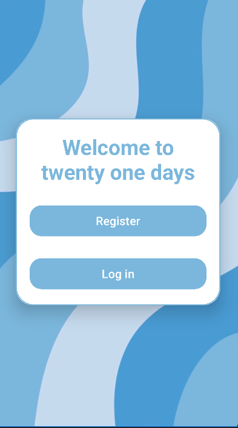

- Module Code:  CS2PJ20
- Assignment report Title:    Spring Android Studio App coursework
- Date (when the work completed): 25/03/2024
- Actual hrs spent for the assignment: 16

## 1. Overview

### a. A brief overview of TwentyOneDays
The TwentyOneDays is a habit-tracking application designed to confront the modern
challenge of procrastination, exacerbated by social media distractions. Targeted at
individuals aiming to enhance their productivity and consistency in habit cultivation,
TwentyOneDays is built to integrate effortlessly into daily life, facilitating the tracking and
monitoring of habit progress. The app&#39;s name, &quot;TwentyOneDays,&quot; is inspired by the popular
belief that it takes 21 days to form a new habit, symbolizing the app&#39;s commitment to
helping users embark on a journey of personal improvement and transformative change.

The name "**TwentyOneDays**" was meticulously chosen to reflect the app&#39;s essence and
mission. It is based on the concept that consistent effort over a period of 21 days can
significantly contribute to the formation of lasting habits. This name highlights the
transformative journey users undertake with the app, emphasizing progress, commitment,
and the potential for change.

### b. Objectives
The development of TwentyOneDays centres around three key objectives:

**User-Friendly**: ensuring the app is accessible and straightforward, with a focus on a simple
yet effective interface to encourage regular use.

**Adaptable**: catering to a wide array of habits and goals by supporting multiple input
methods, allowing users to personalize their habit-tracking experience.

**Motivational**: utilizing visual indicators of progress and motivational elements to keep
users engaged and motivated to maintain their habit streaks.

## 2. Application Specifications
### a. Describing of TwentyOneDays technical specifications:

TwentyOneDays features a modular application structure, with each screen represented as an activity that includes an XML layout and a Java class. These components work together to facilitate smooth user interactions and backend processes. Highlights include:

**Welcome Screen**: designed with interactive elements to guide users through the app’s features.

**User Authentication**: secured with Firestore for robust data management, employing dedicated classes for managing user interactions;

**Functionality**: tailored functions for showcasing recent activity, setting and tracking milestones, and exploring the potential for social connectivity to enhance the user experience.
 

### b. User Interface Design
The app embraces a visually soothing theme, using colors and designs that evoke tranquility and trust, 
making users feel comfortable and secure as they log their activities and track their progress.

I will try to use rounded edges and a more modern font family as rounded edges can improve usability
by reducing the risk of accidental taps or swipes on sharp corners, especially on mobile devices where
precision can be challenging. This can lead to a smoother and more frustration-free user experience,
encouraging users to interact with the app more frequently.Modern font families are often designed with
legibility and readability in mind, making them suitable choices for digital interfaces. These fonts
typically feature clean and well-defined letterforms, which can improve readability on various screen
sizes and resolutions.

To be a successful application, I would have to have a list of features that need to be implemented:

- Basic authentication where a user can enter a name email, username and password and after registering,
   are able to login with that information. 
- A Habit system, a user is able to choose a specific habit that they want to record and the settings 
  around when they want to be reminded about it. 

There are more aspirational features that I would want to implement that would extend upon the features mentioned prior:

- a Social system that allows users to search to see if their friends are using the application and then
  add them, this will allow them to see their friends and if they are keeping on top of their habits.

## 3. Application Implementation

### a. Examination of the basic functionalities 

### b. User Authentication
   

### c. Additional features

#### i. Advanced Authentication

#### ii. 

### 4. Conclusions and Future work

### a. Concluding remarks (Summary of the TwentyOneDays outcomes).
TwentyOneDays sets out to tackle procrastination by empowering users to form and sustain
new habits. Achieving its objectives of being user-friendly, adaptable, and motivational, the
app has made significant strides in enhancing user engagement and facilitating personal
growth.

### b. Reflection on overall learning experience and achievements.
The journey of developing TwentyOneDays has been profoundly educational, offering
insights into the complexities of app development, user experience design, and the
psychology of habit formation. The project's challenges have fostered a spirit of creativity
and resilience, culminating in the successful realization of the app's core features and the
acquisition of positive initial feedback.

### c. Future Work
The roadmap for TwentyOneDays includes exciting opportunities for expansion and
enhancement:

**Enhanced Social Features**: Building on the app's social aspects to encourage community
engagement and mutual support among users.

**Gamification Strategies**: Incorporating elements of gamification to reward progress and
celebrate milestones, boosting user motivation.

**Personalized Insights**: Integrating AI to provide customized advice and insights, making
the habit formation process even more tailored and effective.

**Platform Diversification**: Expanding the app&#39;s availability to web and desktop platforms,
increasing its accessibility to a wider audience.

**Wellness Integration**: Adding features focused on mental and emotional well-being, such
as stress management and mindfulness practices, to support users' overall health.

In conclusion, while TwentyOneDays has successfully met its initial goals, its journey
towards facilitating meaningful habit change and personal development is just beginning.
Future enhancements, guided by user feedback and technological advancements, will
ensure that TwentyOneDays continues to be a pivotal tool for individuals seeking to make
lasting changes in their lives.